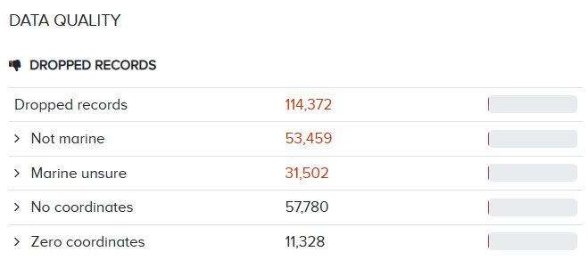

# (PART\*) Ensuring Data Quality {-}

# Data quality control

OBIS ignores records that do not meet a number of standards. For example, all species names need to be matched against an authoritative taxonomic register, such as the World Register of Marine Species. In addition, quality is checked against the OBIS required fields as well as against any impossible values. OBIS checks, rejects and reports the data quality back to the OBIS nodes, but never change records. The OBIS tier 2 nodes are responsible for the data quality and communicate errors back to the data providers. A number of QC tools are developed to help data providers and OBIS nodes:

* [QC tool for species names](name_matching.html)
* [QC tool for geography and data format](lifewatch_qc.html)

For specific concerns regarding quality control checks or issues, please submit a GitHub ticket to the [OBIS QC repository](https://github.com/iobis/obis-qc/issues).

## Why are records dropped?

 Records can be dropped and therefore not published with your dataset for a number of reasons, including:

* The species is not marine
* The ‘scientificName’ or `scientificNameID` did not match with WoRMS
* Issues with coordinates:
  * No coordinates given
  * `decimalLatitude` or `decimalLongitude` out of range
* The coordinate is zero

For each dataset published, a quality report is generated where the number of dropped records and other quality issues will be flagged. Such reports can also be found when searching for data in OBIS. For example, if we searched for ‘Crustacea’ records, the following data quality report is given:



We can see that >110,222 Crustacean records have been dropped, mostly due to records missing coordinates or species being flagged as non-marine. Because species are determined as being marine by WoRMS, we acknowledge that sometimes species are marked as `not_marine` erroneously.For specific advice on this topic, see the [common QC issues page](common_qc.html#non-marine-species).

To minimize the number of records dropped, be careful when formatting your data so that you are meeting the requirements.

## How to conduct Quality Control

Once you have formatted your data for OBIS, or have received a formatted dataset, it is important to run quality control checks before publishing the dataset on the IPT. The following is a list of various tools you can use to help you perform quality checks on your data:

* R package [obistools](https://github.com/iobis/obistools)
* EMODnet Biocheck
  * [Web UI](https://rshiny.lifewatch.be/BioCheck/) built on obistools. This tool requires your dataset to be published on an IPT (e.g., a test IPT such as <https://ipt.gbif.org/> where your dataset will not be harvested by GBIF or OBIS). Note you are [required to have a login](ipt.html) to access an IPT
  * [R package](https://github.com/EMODnet/EMODnetBiocheck)
* [Lifewatch data services](https://www.lifewatch.be/data-services/)
* The US Integrated Ocean Observing System [Standardizing Marine Bio Data Guide](https://github.com/ioos/bio_data_guide/blob/main/datasets/TPWD_HARC_BagSeine/TPWD_HARC_BagSeine_OBISENV.md)
* [WoRMS taxon match tool](https://www.marinespecies.org/aphia.php?p=match)
  * [Other WoRMS web services, incl. taxon match](https://www.marinespecies.org/aphia.php?p=webservice)
* Excel Conditional Formatting tool
  * Excel > Home > Conditional Formating > Highlight cells Rules > Duplicate values...
* [GBIF data validator](https://www.gbif.org/tools/data-validator)
* [Python library for OBIS QC](https://github.com/cioos-siooc/pyobistools) developed by Canadian Integrated Ocean Observing System
* R package and function [Hmisc](https://hbiostat.org/r/hmisc/):: describe
  * Can give important summary statistics and identify numbers that don’t match

### Conducting QC with obistools {.unlisted .unnumbered}

Installing `obistools`  requires the devtools package. Use the following code to install both packages:

```R
install.packages("devtools")
devtools::install_github("iobis/obistools")
```

If you have difficulty installing `obistools`, please try updating your R packages, in particular the `vctrs` package. This can be done in RStudio in the Packages tab ("update" button) or by using the `update.packages()` command (you can choose which packages to update). If you cannot install `obistools` please reach out to helpdesk@obis.org and we will help you.

To use `obistools` to conduct quality control, you can follow the general order below. Please see the [`obistools` GitHub](https://github.com/iobis/obistools) for examples of how to use the functions.

1. Check that the taxa match with WoRMS
    * [`obistools::match_taxa`](https://github.com/iobis/obistools#taxon-matching)
2. Check that all required fields are present in the occurrence table
    * [`obistools::check_fields`](https://github.com/iobis/obistools#check-required-fields)
3. Check coordinates
    * Plot them on a map to identify any points that appear outside the scope of the dataset [`obistools::plot_map`](https://github.com/iobis/obistools#plot-points-on-a-map). Using `obistools:plot_map_leaflet()` will additionally allow you to identify the row number for a particular data point.
    * Check that points are not on land [`obistools::check_onland`](https://github.com/iobis/obistools#check-points-on-land)
    * Ensure depth ranges are valid [`obistools::check_depth`](https://github.com/iobis/obistools#check-depth)
4. Check that the identifiers are present, unique, and appropriately correspond with each other [`obistools::check_eventids`](https://github.com/iobis/obistools#check-outliers). You should also check the uniqueness of the `occurrenceID` field (e.g. using `Hmisc::describe` or simple code like `length(occur$occurrenceID) == length(unique(occur$occurrenceID))`)
    * Ensure all `eventIDs` in extensions have matching `eventIDs` in the core table [`obistools::check_extension_eventids`](https://github.com/iobis/obistools#check-eventid-in-an-extension)
5. Check that `eventDate` is formatted properly [`obistools::check_eventdate`](https://github.com/iobis/obistools#check-eventdate)
6. Check for statistical outliers or other anomalies with Hmisc (below)

### QC with R package Hmisc {.unlisted .unnumbered}

The R package [Hmisc](https://hbiostat.org/r/hmisc/) has the function [`describe`](https://rdrr.io/cran/Hmisc/man/describe.html) which can help you identify any discrepancies or outliers in your dataset.

It will summarize each of your variables for a given data field. This can help you quickly identify any missing data and ensure the number of unique IDs is correct. For example, in an Occurrence table with 1000 records, there should be 1000 unique occurrenceIDs.

```R
library(Hmisc)
library(Hmisc)
data<-read.csv("example_data_occur.csv")
describe(data)
 
 12  Variables      407  Observations
------------------------------------------------------------------------------------------------------------------
CollectionCode 
       n  missing distinct    value 
     407        0        1  BIOFUN1 
                  
Value      BIOFUN1
Frequency      407
Proportion       1
------------------------------------------------------------------------------------------------------------------
eventID 
       n  missing distinct 
     407        0       27 

lowest : BIOFUN1_BF1A01 BIOFUN1_BF1A02 BIOFUN1_BF1A03 BIOFUN1_BF1A04 BIOFUN1_BF1A05
highest: BIOFUN1_BF1M3  BIOFUN1_BF1M4  BIOFUN1_BF1M6  BIOFUN1_BF1M8  BIOFUN1_BF1M9 
------------------------------------------------------------------------------------------------------------------
occurrenceID 
       n  missing distinct 
     407        0      407 

lowest : CSIC_BIOFUN1_1   CSIC_BIOFUN1_10  CSIC_BIOFUN1_100 CSIC_BIOFUN1_101 CSIC_BIOFUN1_102
highest: CSIC_BIOFUN1_95  CSIC_BIOFUN1_96  CSIC_BIOFUN1_97  CSIC_BIOFUN1_98  CSIC_BIOFUN1_99 

```

This video shows how to use both `obistools` and `Hmisc` to conduct QC checks in R.

  <iframe width="560" height="315"
src="https://www.youtube.com/embed/sNzipC6-r90"
frameborder="0"
allow="accelerometer; autoplay; encrypted-media; gyroscope; picture-in-picture"
allowfullscreen></iframe>
