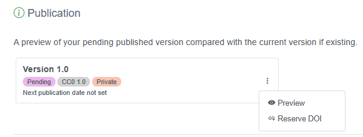
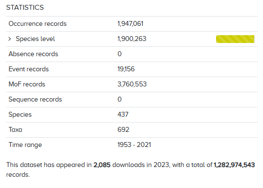

## Maintaining and sharing published data

**Content**
 
* [Add a DOI](#adding-a-doi-to-datasets)
* [User tracking](#user-tracking)
* [Update your own data](#update-your-data-in-obis)
* [Publish to OBIS and GBIF](#publish-obis-data-to-gbif)

### Adding a DOI to datasets

DOIs are important for tracking your dataset. Fortunately you can easily reserve a DOI for your dataset if the IPT administrator has configured the IPT accordingly.

As the IPT administrator, you must enable the capacity for users to reserve DOIs. To do this you first need a [DataCite account](https://datacite.org/) associated with an Organization. Only one DataCite account can be used to register DOIs in this manner (i.e. IPT users do not need an account). The IPT’s archival mode, configurable on the IPT settings page, must also be turned on (note that enabling this mode will use more disk space) to enable this feature. For more information see the [IPT administration manual](https://ipt.gbif.org/manual/en/ipt/latest/administration).

Once this has been configured, a data provider or admin can easily reserve a DOI for a dataset. First log in to the IPT, navigate to the Manage Resources tab, then select the dataset for which you wish to reserve a DOI. On the overview page for the dataset, scroll to the Publication section, click the three vertical dots and select “Reserve DOI”.  

{width=80%}

### User tracking

OBIS tracks the number of times your dataset is downloaded. This information is available on your dataset’s page under the Statistics box.

{width=70%}

## Update your data in OBIS

To update your own data in OBIS, the process is largely the same as [publishing your first version](ipt.html#publish-on-the-ipt). Follow the steps below:

- Log in to the IPT where your data are hosted
- Under the Manage Resources tab, locate your dataset
- Upload new files, complete the DwC mapping, and/or update any metadata that may have changed
- In the Publication section, click Publish just as you did before

The new version will be automatically updated. A new DOI will be generated only if you generate it yourself on the new version. Deciding when to generate a new DOI is up to you, but generally you should generate a new DOI when there have been major changes to your dataset, such as significant changes in your metadata or a move to a 2.0 resource version within the IPT.

{width=80%}

## Publish OBIS data to GBIF

There are a few differences between OBIS and GBIF. Perhaps the most obvious difference is that OBIS focuses on marine data, whereas GBIF includes broader biodiversity data. However, OBIS implements more strict quality control requirements for published datasets. A complete list of GBIF’s quality control checks can be found [here](https://data-blog.gbif.org/post/issues-and-flags/), and a guide on GBIF’s publishing process is [here](https://www.gbif.org/publishing-data).

OBIS currently accepts two core data table types: Occurrence core and Event core. GBIF includes both [Occurrence](https://www.gbif.org/data-quality-requirements-occurrences) and [Event](https://www.gbif.org/data-quality-requirements-sampling-events) core, with one additional core type, [Checklists](https://www.gbif.org/data-quality-requirements-checklists). GBIF is also developing a [new data model](https://www.gbif.org/composition/HjlTr705BctcnaZkcjRJq/data-model-principal-composition) to expand data publishing capabilities.

Some of the other main differences in how OBIS and GBIF structure and publish datasets that you should be aware of include:

* OBIS uses [WoRMS](https://www.marinespecies.org/index.php) as the exclusive taxonomic backbone (and WoRMS identifiers to populate `scientificNameID`), whereas GBIF uses [Catalog of Life](https://www.catalogueoflife.org/) and does not currently require the use of taxonomic identifiers
* The OBIS-ENV-DATA structure, the eMoF extension, and the DNA Derived data extensions are not included in GBIF downloads (e.g., [this dataset description](https://www.gbif.org/dataset/be77e203-486c-4651-91b9-8347968b728c#description)). This data can still be published alongside your dataset, and is available when it is downloaded from the Source archive, but it will not be included in a GBIF Annotated Archive download.
* OBIS conducts some QC procedures that GBIF does not, including:
  * Checking validity of depth measurements
  * Checking validity of WoRMS LSID
  * Identifying if taxa are exclusively freshwater or terrestrial
* GBIF includes most of the same [data standards](https://www.gbif.org/standards) as OBIS (Darwin Core, EML), however GBIF also follows the [Biological Collection Access Service (BioCASE/ABCD)](https://www.tdwg.org/standards/abcd/#parts%20of%20the%20standard)

Watch the video below for details on how to publish OBIS datasets to GBIF (starting at 1:07), or how to publish GBIF datasets to OBIS (starting at 6:42).

  <iframe width="560" height="315"
src="https://www.youtube.com/embed/HciufRG9hiI"
frameborder="0"
allow="accelerometer; autoplay; encrypted-media; gyroscope; picture-in-picture"
allowfullscreen></iframe>

See the tables below for a quick comparative reference on which terms are required or recommended in OBIS and GBIF for Occurrence and Event tables.

**Event Table:**

| Term | Status in OBIS | Status in GBIF |
|----|----|---|
| eventID | **required** | **required** |
| eventDate | **required** | **required** |
| decimalLatitude & decimalLongitude | **required** | strongly recommended |
| samplingProtocol | strongly recommended | **required**  |
| samplingSizeValue & samplingSizeUnit | strongly recommended | **required**  |
| countryCode | strongly recommended | strongly recommended |
| parentEventID | strongly recommended | strongly recommended |
| samplingEffort | strongly recommended | strongly recommended |
| locationID | strongly recommended | strongly recommended |
| coordinateUncertaintyInMeters | strongly recommended | strongly recommended |
| geodeticDatum | recommended | strongly recommended |
| footprintWKT | recommended | strongly recommended |
| occurrenceStatus | required in occurrence extension | strongly recommended |

**Occurrence Table:**

| Term | Status in OBIS | Status in GBIF |
|----|----|---|
| occurrenceID | **required**  | **required**  |
| eventDate | **required**  | **required**  |
| scientificName | **required**  | **required**  |
| basisOfRecord | **required**  | **required**  |
| kingdom | recommended | **required**  |
| decimalLatitude & decimalLongitude | **required**  | strongly recommended |
| scientificNameID | **required**  | not required, accepted |
| occurrenceStatus | **required**  | not required, accepted |
| taxonRank | strongly recommended | strongly recommended |
| coordinateUncertaintyInMeters | strongly recommended | strongly recommended |
| individualCount, organismQuantity & organismQuantityType | strongly recommended | strongly recommended |
| geodeticDatum | recommended | strongly recommended |
| eventTime | recommended | not required, accepted |
| countryCode | not required, accepted | strongly recommended |
| informationWithheld | not required, accepted | not required, accepted |
| dataGeneralizations | not required, accepted | not required, accepted |
| country | not required, accepted | not required, accepted |
