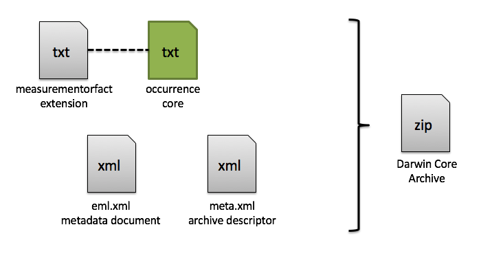
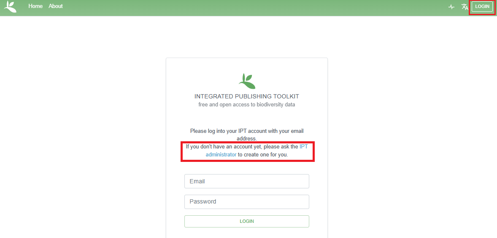
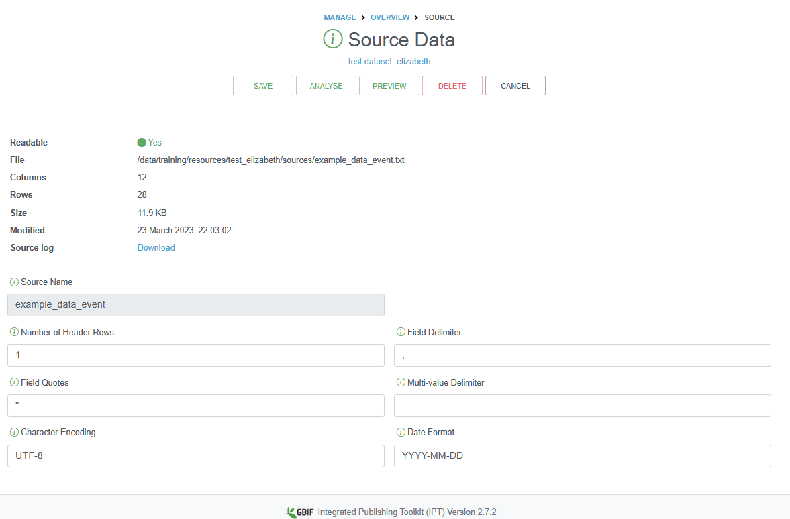
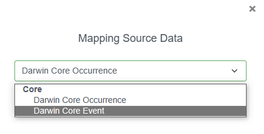
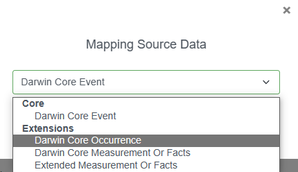
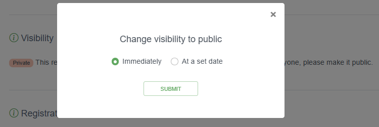

## IPT: Integrated Publishing Toolkit

**Contents:**

- [Introduction](#introduction-to-the-ipt-unlisted-unnumbered)
- [How to access the IPT](#how-to-access-the-ipt-unlisted-unnumbered)
- [Who populates IPTs?](#who-populates-the-ipt-with-datasets)  
- [Upload data](#create-your-resource-on-the-ipt-unlisted-unnumbered)  
- [Map to Darwin Core](#map-your-data-to-darwin-core-unlisted-unnumbered)  
- [Add metadata](#add-metadata-unlisted-unnumbered)  
- [Publish on the IPT](#publish-on-the-ipt-unlisted-unnumbered)  
- [Publish your data as a dataset paper](#publish-your-metadata-as-a-data-paper)
- [Download data from the IPT](#downloading-datasets-from-an-ipt-unlisted-unnumbered)

### Introduction to the IPT {.unlisted .unnumbered}

Before we get into the details for accessing and using the IPT, let’s understand what it is. Biodiversity datasets and their metadata are published in OBIS using the Integrated Publishing Toolkit (IPT), developed by GBIF. The IPT is an open source web application that can be customized by the OBIS node manager (see [IPT admin page](ipt_admin.html) for details). An IPT-instance is used to publish and register all datasets. To be able to create and manage your own dataset (called a “resource” by GBIF), you will need a user account. In general, the IPT software assists users in mapping data to valid Darwin Core terms, as well as archiving and compressing the Darwin Core content with:

1. A descriptor file: `meta.xml` that maps the core and extensions files to Darwin Core terms, and describes how the core and extensions files are linked
2. The `eml.xml` file, which contains the dataset metadata in [Ecological Metadata Language](https://en.wikipedia.org/wiki/Ecological_Metadata_Language) (EML) format. For instructions on how to enter the metadata go to [EML](eml.html).

All these components (i.e., core file, extension files, descriptor file, and metadata file) become compressed together (as a .zip file) and comprise the Darwin Core Archive.

{width=70%}

### How to access the IPT {.unlisted .unnumbered}

Once you have determined which [OBIS node IPT](https://ipt.iobis.org/) is suited for your dataset, you can contact your node manager to create an associated account for you. There will be a link on the sign in page that will direct you to the IPT’s administrator to contact them. If your node’s IPT is not listed here, you will have to [contact the node manager](https://obis.org/contact/) to get the link to their IPT.

{width=90%}

If you are an IPT admin and want to know how to set up an IPT yourself, see the [IPT admin page](ipt_admin.html).

#### Who populates the IPT with datasets?

With regard to populating the IPT with marine data for OBIS, there are two possible approaches:

1. Manager driven: You as node manager take the responsibility of describing, checking and uploading the data and metadata to the IPT. The data provider can send you the data ‘as such’ or you can make agreements with your providers on the accepted OBIS data format and standards. This approach will give you a very good knowledge of what data is available. It can be time-consuming, as (extended) communication with the data provider will be necessary to document the metadata and to re-format the data to the OBIS standards.

2. User driven: You as node manager can guide (some of your) data providers to publish the data and metadata to the IPT themselves. Your main task will be to make sure that all relevant information and data for OBIS is available and that you perform the necessary quality checks before the data are released to OBIS. Once the Darwin Core Archive is created, the data provider should inform the node manager of this action, so he or she can do the necessary quality control checks. In order for the node manager to be able to look at the dataset, the data provider should add him or her as a “resource manager” to this specific dataset.

In most cases, there will be a combination of these two approaches. The chosen approach will largely depend on the capacity, availability and willingness of your data provider to invest extra time in formatting and thoroughly describing their data. If you – as node manager – would prefer a partly user driven approach, the following steps to publishing marine data to OBIS briefly explains how you or a data provider can upload, standardize and publish a dataset on the OBIS node IPT, without the hassle of installing and maintaining an IPT instance. The data are published in your organization’s name. This guide is based on the Canadensys 7-step guide to publishing marine data:

Desmet, P. & C. Sinou. 2012. 7-step guide to data publication. Canadensys. <http://community.canadensys.net/publication/data-publication-guide>.

> Caution: Make sure you have obtained the rights from the data owners to publish their data!

### Create your resource on the IPT {.unlisted .unnumbered}

Once you have your account, login at the top of the IPT page. Click on the tab Manage resources: it will display all the datasets you are managing and will be empty at first. You can create a new resource at the bottom of the page. Follow the [GBIF IPT manual](https://ipt.gbif.org/manual/en/ipt/latest/manage-resources#create-a-new-resource) for more detailed instructions.

{width=80%}

The first thing that needs to be completed is the shortname of your resource. This shortname uniquely identifies your resource (i.e. dataset) and will eventually show up in the URL of this resource on IPT. These shortname identifiers are also used to create folders on the IPT and **they cannot be changed**.

We therefore advise that the shortname:

- is unique, descriptive and short (max. 100 characters)
- does not contain a space, comma, accents or special characters

Shortname good examples:

- VLIZ_benthos_NorthSea_2000
- UBC_algae_specimens
- ...

> **When you would delete a resource, please inform your node manager of this action! If you create a test-file, please include `_test` at the end of your shortname.**

Then select the type of data you are uploading: Occurrence, Checklist, Sampling-Event (i.e. Event Core), Metadata only, or Other. Note that [Checklist datasets](https://www.gbif.org/data-quality-requirements-checklists) are accepted by GBIF, but not currently implemented in OBIS. However, you can still have checklist data hosted on OBIS IPTs.

You can also create an entirely new resource by uploading an existing archived resource. See the IPT manual section [Upload a Darwin Core-Archive](https://ipt.gbif.org/manual/en/ipt/latest/manage-resources#upload-a-darwin-core-archive) for instructions.

Please note the IPT has a 100MB file upload limit, however, there is no limit to the size of a Darwin Core Archive that the IPT can export/publish. Refer to [this note](https://ipt.gbif.org/manual/en/ipt/latest/manage-resources#upload-limits) in the IPT manual to find out how to work around the file upload limit.

Once you have created your resource, you will see an empty resource overview page.

#### Upload data

Uploading your source file to the IPT is easy: go to > your resource overview page > Source Data and click on Choose File. This is where you will select and add the files containing your Core table and (if applicable) extensions.

You might want to compress/zip your source file first to improve the upload speed of large files. The IPT will unzip them automatically once received. Follow the [IPT manual](https://ipt.gbif.org/manual/en/ipt/latest/manage-resources#create-a-new-resource) for more detailed instructions (including the option to use multiple source files or to upload via a direct database connection).

Accepted formats are delimited text files (csv, tab and files using any other delimiter), either directly or compressed as zip or gzip.

{width=80%}

Let’s follow an example Event core dataset. The first file we will upload will be a .csv file containing the Event core table. After it’s been selected, we click “Add”.

A source file detail page will then be shown, displaying how the IPT has interpreted your file (number of columns, rows, header rows, character encoding, delimiters, etc.). Click the preview button to verify everything is correct, click anywhere on the screen to exit the preview, then click save.

{width=90%}

You can also provide information about how the data table is encoded, how many header rows exist, the type of delimiters, and what type of character encoding you used. You may need to double check the [character encoding](https://en.wikipedia.org/wiki/Character_encoding) for your file, especially if you used any special characters (e.g., in species or place names). **UTF-8** is one of the most common encoding standards, and you can select this encoding when saving files, depending on the software used:

- Windows: MS Excel: select Save as. From the drop down select the “CSV UTF-8 (Comma delimited)” option
- Windows: Notepad: Click on File, then Save as
  - In the drop down menu "Save as type" drop-down, select All Files
  - In the "Encoding" drop-down on the bottom right, select UTF-8.
  - Be sure to name your file using the .csv extension (e.g., data.csv).
- Mac: Numbers: Select File then Export to...  -> CSV.
  - Click Advanced options
  - Click the drop-down menu next to Text Encoding and select Unicode (UTF-8)
  - Click Next, then finally name your file, select a location, and click Save

  Once you have specified all the above information, click Save, This will redirect you back to the Overview page for your dataset. You can add multiple files for each of your tables by clicking the three vertical dots to the right and “+ Add”. We will add a .csv file for an Occurrence extension, as well as one for the eMoF extension.

{width=90%}

### Map your data to Darwin Core {.unlisted .unnumbered}

Because biodiversity data are published in the [Darwin Core](https://manual.obis.org/darwincore) standard, the next step is to map your data fields to Darwin Core. As we have mentioned earlier in this manual, the DwC standard includes a list of defined terms and allows your data to be understood and used by others. It also allows an aggregator like OBIS or GBIF to integrate your data with other datasets.

Darwin Core mapping is the process of linking the fields in your resource file with the appropriate Darwin Core terms. It is the most challenging step in publishing your data for two reasons:

1. The list of Darwin Core terms can be overwhelming, so it might be difficult to select the ones that are appropriate for your dataset
2. The IPT currently only allows one-to-one mapping of fields, so the ease of mapping will depend on your database structure and on the feasibility of exporting as close to Darwin Core as possible. You can contact your node manager or the OBIS secretariat at info@iobis.org to help guide you through the steps, review your mapping, suggest terms etc. You also welcome to post questions in the [OBIS Slack](https://join.slack.com/t/obishq/shared_invite/zt-1nrokd987-aSah0CfXb5MoY10t1olnhQ).

You can find more information regarding Darwin Core mapping in the [IPT manual](https://ipt.gbif.org/manual/en/ipt/latest/manage-resources#darwin-core-mappings) (including core types, extensions, auto-mapping, default values, value translation, etc.).

To add the DwC mappings, click the three vertical dots to the right of this section and select “+ Add”

{width=90%}

A popup window will allow you to select your Core type to facilitate mapping - Occurrence or Event core. In this example, we will select Darwin Core Event for the Event core table.

{width=70%}

Next we will confirm which file we are mapping to: the .csv file containing our event data. Then click Save.

Because we had already named several of our fields with Darwin Core terms, they have been auto-mapped for us. It is important to review each Darwin Core class (Record, Event, Location, etc.) and ensure any unmapped fields are mapped to the correct DwC term. When you select a term, a drop down menu will appear where you can select the appropriate field from your dataset. It is good practice to double check that the auto-mapped fields are mapped correctly.

Once you are done mapping, any unmapped fields will appear at the bottom of the page for you to check. If there is no DwC term to map these terms to, that is okay, but the data will not be published alongside the rest of your dataset. Consider moving these unmapped fields to either `dynamicProperties` or to one of the extensions (e.g., eMoF), whichever is most applicable.

Finally, click Save. You may return to the Overview page by clicking Back. To add DwC mappings for the other files (Occurrence and eMoF), click the same “+ Add” button and go through the same process for each extension table you have.

The IPT may identify Redundant terms if certain terms appear in the e.g., Event core and Occurrence extension. If your Occurrence extension (or core) contains information about individualCount and organismQuantity, you can map such fields in both the Occurrence and the eMoF as a measurementType.

{width=70%}

Watch the video below for an overview of all of the above procedures, from uploading data to mapping terms to DwC.

  <iframe width="560" height="315"
src="https://www.youtube.com/embed/i2P8mjo128o"
frameborder="0"
allow="accelerometer; autoplay; encrypted-media; gyroscope; picture-in-picture"
allowfullscreen></iframe>

The next step is to fill in or upload metadata.

### Add metadata {.unlisted .unnumbered}

Metadata enables users to discover, assess, understand and attribute your dataset for their particular needs, so it pays off to invest some time providing them.

Go to your resource overview page > Metadata and click Edit to open the metadata editor. Any information you provide here will be visible on the resource homepage and bundled together with your data when you publish.

{width=80%}

Follow the guidelines on the [OBIS metadata standards and best practices](eml.html) page, or check the [IPT manual](https://ipt.gbif.org/manual/en/ipt/latest/manage-resources#metadata) for detailed instructions about the metadata editor. You can also upload a file with metadata information. The video below also demonstrates how to fill metadata on the IPT.

  <iframe width="560" height="315"
src="https://www.youtube.com/embed/oAoQsDkZpS8"
frameborder="0"
allow="accelerometer; autoplay; encrypted-media; gyroscope; picture-in-picture"
allowfullscreen></iframe>

### Publish on the IPT {.unlisted .unnumbered}

With your dataset uploaded, properly mapped to DwC, and all the metadata filled, you can publish your dataset. On your resource overview page, go to the Publication section, click the vertical dots and select Publish.

{width=80%}

The IPT will now generate your data as Darwin Core, and combine the data with the metadata to package it as a standardized zip-file called a “Darwin Core Archive”. See the IPT manual for more details.

> **Note:** Hitting the "publish" button does not mean that your dataset is available to everyone, it is still private, with access limited to the resource managers. It will only be publicly available when you have changed Visibility to Public. You can choose to do this immediately or at a set date.

{width=80%}

Your dataset will only be harvested by GBIF when you change Registration to Registered. This step is not needed for OBIS to harvest your datasets. Please do not register your dataset with GBIF if your dataset is already published in GBIF by another publisher. Note that the IPT itself must be [registered with GBIF](ipt_admin.html) in order to publish to GBIF. The node manager can do this.

{width=70%}

Back on the resource overview page > Published Release, you can see the details of your first published dataset, including the publication date and the version number. Since your dataset is published privately, the only thing left to do is to click Visibility to Public (see the IPT manual) to make it available to everyone.

> **Warning**: please do **not** do this with your test dataset.

It is now listed on the IPT homepage and you can share and link to it, e.g.: `http://ipt.vliz.be/resource.do?r=kielbay70`. This would be a good time to notify any regional or thematic network you are involved in, which can also have an interest in your dataset.

Your published dataset is a static snapshot of your data and will not change until you upload an updated source file and click publish again or publish a new version (do not create a new resource). This procedure has the advantage that your dataset is always available, does not require a live internet connection to your database and can be easily shared. It also allows you to control the publication process more precisely: version 1, version 2, etc. and users are informed of how recent the data are (via the last publication date).

To view an older version of the metadata about the resource, just add the trailing parameter `&v=n` to the URL where `v` stands for "version", and `n` gets replaced by the version number, e.g., `http://ipt.vliz.be/ilvo/resource.do?r=zoopl_bpns&v=1`. In this way, specific versions of a resource's EML, RTF, and DwC-A files can be retrieved. Please note, the IPT's Archival Mode must be turned on in order for old versions of DwC-A to be stored (see [Configure IPT settings](https://ipt.gbif.org/manual/en/ipt/latest/administration) section of the IPT manual).

The first minute of the video below provides an overview of how to publish on the IPT.

  <iframe width="560" height="315"
src="https://www.youtube.com/embed/HciufRG9hiI"
frameborder="0"
allow="accelerometer; autoplay; encrypted-media; gyroscope; picture-in-picture"
allowfullscreen></iframe>

#### Publish your metadata as a data paper

The Metadata expressed in the EML Profile standard can also be downloaded as a Rich Text Format (RTF) file. The latter can serve as a draft manuscript for a data paper ([First database-derived 'data paper' published in journal](http://www.eurekalert.org/pub_releases/2011-11/gbif-fd112711.php)), which can be submitted for peer-review to e.g. a [Pensoft journal](http://journals.pensoft.net/).

### Downloading datasets from an IPT {.unlisted .unnumbered}

To download a dataset from an IPT, simply navigate to the IPT home page (not the Manage Resources tab) and search for the dataset in question. You can search for keywords in the Filter box on the right side of the page. Generally you do not need to log in to an IPT to download a dataset.

{width=90%}

Once you navigate to the page of a dataset, at the top of the page you will have options to download the whole Darwin Core Archive file, or just the metadata as an EML or RTF file. Be sure to note the license associated with the dataset.

{width=90%}
